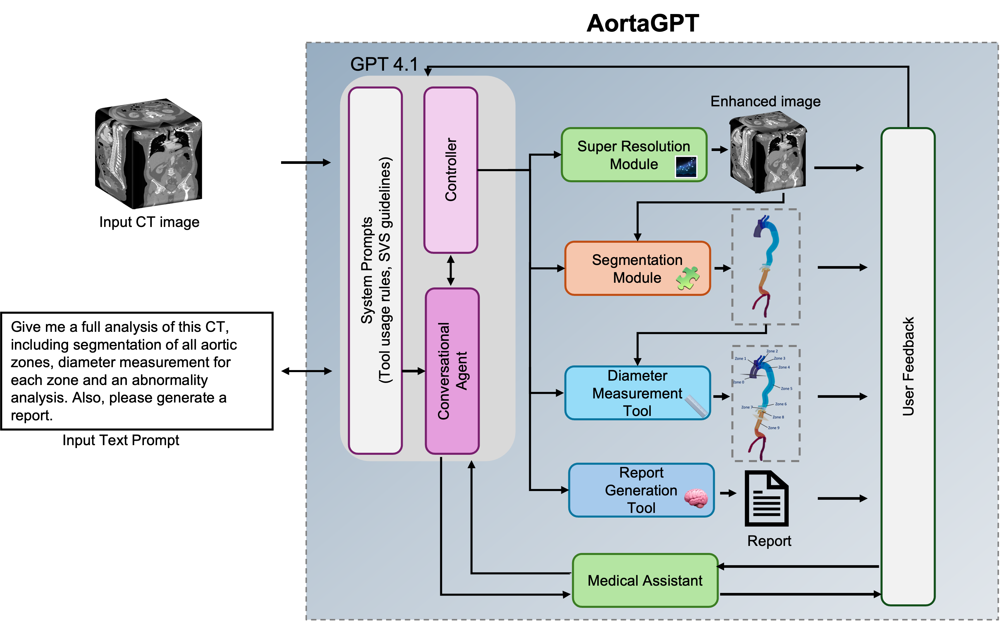

AortaGPT
End-to-End Aortic CT Analysis with Deep Learning and Vision-Language Models

AortaGPT is an interactive AI system for automated aortic CT analysis. The framework combines deep learning, geometric analysis, natural language interaction, and structured reporting into a unified workflow designed for both research and clinician-facing applications.

<p align="center">  </p>


# Using AortaGPT

## Basic Workflow

AortaGPT follows a dependency-aware pipeline:

```text
Upload CT
   ↓
Super-Resolution (optional)
   ↓
Segmentation
   ↓
Diameter Measurement
   ↓
Abnormality Analysis
   ↓
Report Generation
```

The system automatically determines which stages are required based on:
- image spacing
- current pipeline state
- user intent

---

## Example Usage

### Run Full Analysis

```python
agent = AortaAgent()

# Load CT volume
agent.load_nifti("scan.nii.gz")

# Run complete pipeline
agent.ensure_super_resolved()
agent.ensure_segmentation()
agent.ensure_diameters()

# Generate report
agent.generate_pdf_report()
```

---

### Generate Segmentation Only

```python
agent = AortaAgent()

agent.load_nifti("scan.nii.gz")
agent.ensure_segmentation()
```

---

### Generate Diameter Measurements

```python
agent = AortaAgent()

agent.load_nifti("scan.nii.gz")
agent.ensure_diameters()
```

Segmentation will automatically run if required.

---

## Natural Language Interaction

The Gradio interface supports conversational interaction.

Example commands:

```text
Run full analysis
Segment the descending aorta
Show only iliac diameters
Generate PDF report
```

The LangGraph controller automatically:
- parses intent
- determines required modules
- executes dependencies
- reuses cached results

---

# Pipeline Components

## 1. Super Resolution

Purpose:
- enhance anisotropic CT scans
- improve downstream segmentation quality

Main class:

```python
SuperResolution
```

---

## 2. Segmentation

Purpose:
- zone-based aortic labeling

Main class:

```python
AortaSegmentation
```

Outputs:
- segmentation masks
- overlays
- 3D meshes

---

## 3. Diameter Analysis

Purpose:
- compute cross-sectional vessel diameters

Main class:

```python
AortaAnalysis
```

Outputs:
- diameter tables
- guideline-aware interpretation

---

## 4. LangGraph Controller

Purpose:
- orchestrate pipeline execution

Responsibilities:
- route imaging vs knowledge queries
- enforce execution order
- resolve ambiguities
- maintain system state

Main graph builder:

```python
build_aorta_graph_step3()
```

---

# Folder Structure

```text
AortaGPT/
│
├── app.py                         # Main Gradio application
├── controller/                    # LangGraph orchestration
├── analysis/                      # Diameter computation
├── segmentation/                  # Segmentation models
├── super_resolution/              # SR models
├── visualization/                 # Plotly + overlays
├── reporting/                     # PDF generation
├── utils/                         # Helper utilities
├── outputs/                       # Saved reports/results
├── figures/                       # README and paper figures
└── requirements.txt
```

---

# Extending the Codebase

## Add a New Segmentation Model

1. Add model implementation under:

```text
segmentation/
```

2. Update:
```python
ensure_segmentation()
```

3. Register visualization colors/classes.

---

## Add a New Pipeline Node

1. Create a LangGraph node function.
2. Register node inside:

```python
build_aorta_graph_step3()
```

3. Add dependency routing logic inside:

```python
_imaging_next()
```

---

# Outputs

Generated outputs may include:

- segmentation masks
- 3D meshes
- diameter tables
- abnormality summaries
- exported PDF reports

Reports are saved under:

```text
outputs/
```

---

# Troubleshooting

## CUDA Out of Memory

Reduce:
- mesh resolution
- batch size
- SR usage

---

## Segmentation Not Running

Check:
- NIfTI format
- image spacing
- GPU availability

---

## Empty Diameter Results

Diameter computation requires:
- valid segmentation
- visible anatomical regions
